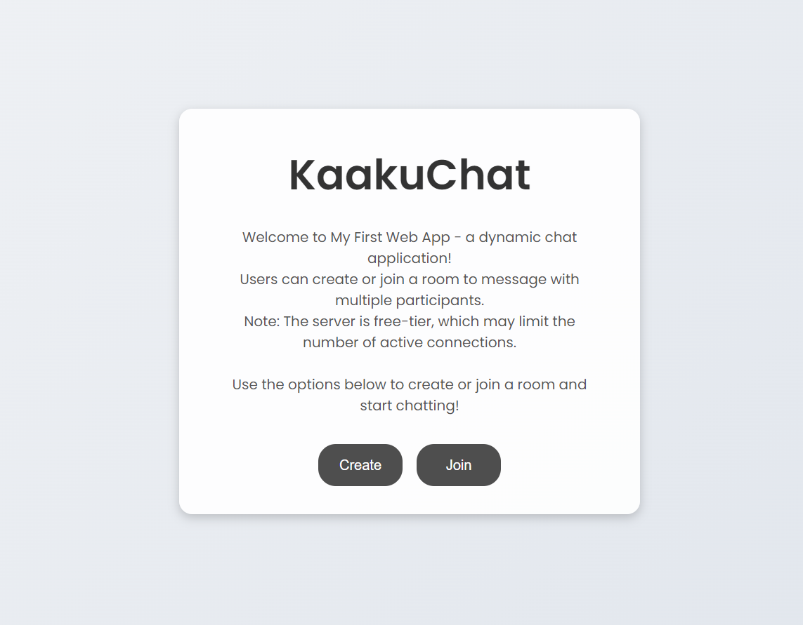

# KaakuChat

**KaakuChat** is a real-time group chat web app that lets users create or join chat rooms and chat with others instantly. Built using Node.js and Socket.io, it supports dynamic room creation, user presence tracking, and responsive UI.

## Live Demo
[**Live KaakuChat**](https://developerkaku.github.io/kakuchat.com)

## Features
- Real-time messaging using WebSockets
- Create or join chat rooms
- Randomized loader animation (e.g., "Powering up to 73%...")
- Server sleeps after 15 mins of inactivity (free-tier hosting)
- Simple, responsive UI

## Tech Stack
- Frontend: HTML, CSS, JavaScript
- Backend: Node.js, Express.js
- Real-time: Socket.io
- Deployment: Render

## Getting Started
> ❗ **Warning:** Ensure *Git*, *Node.js* and *NPM* are installed before running the script.
**Clone the repository:**
```bash
git clone https://github.com/Developerkaku/kaakuchat.git
```
**Navigate to the project directory:**
```bash
cd kaakuchat
```
**Install the necessary packages:**
```bash
npm install
```
**Run the server:**
```bash
node index.js
```
---
## Screenshots

